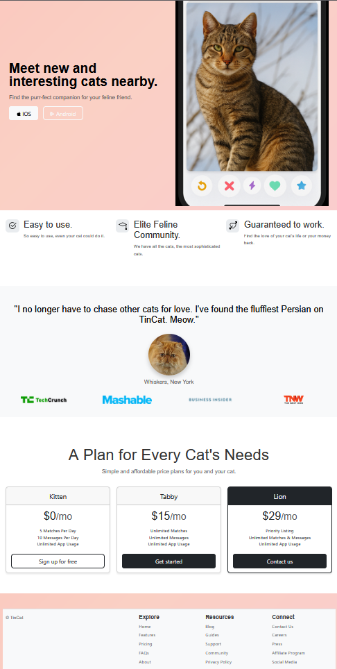

# TinCat - Find Your Cat's Match

TinCat is a whimsical, responsive, and stylish landing page built with HTML, CSS, and Bootstrap. 
Designed to match cats with their purr-fect companions, this project is a creative take on modern dating platforms with a feline twist.

## Features

- **Elegant UI** - Gradient animations and modern typography for an eye-catching design.
- **Cat-focused Content** - Fun, themed sections including features, testimonials, and pricing.
- **Mobile-Responsive** - Fully responsive layout using Bootstrap 5.
- **Pricing Plans** - Three-tier subscription options tailored for every cat's need.

## Project Structure

```
├── index.html         # Main HTML file with page structure and content
├── style.css          # Custom CSS styles and animations
├── images/            # Contains visual assets used in the site
```

## Tech Stack

- HTML5
- CSS3
- [Bootstrap 5](https://getbootstrap.com/)
- Custom Fonts & Icons (via Bootstrap Icons)

## Installation

To run this project locally:

```bash
git clone https://github.com/your-username/tincat.git
```

## Screenshot

